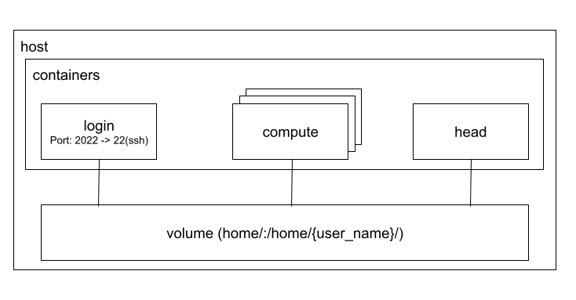

# docker-compose-hpc

HPCでよく用いられている [Environment Modules](https://modules.readthedocs.io/en/latest/) と [ジョブスケジューラ(OpenPBS)](https://www.openpbs.org/) をお手軽に体験するための docker-compose 環境です。

## 構成の概要

以下の3種類のノードからなっており、ホストの `./home` をそれぞれ `/home/{user_name}` (`{user_name}` は docker-compose コマンドの実行ユーザー) にマッピングすることでノード間のファイル共有を実現しています。

1. login
    - ユーザーがSSHでログイン (localhost:2022) して各種設定やジョブの投入を行うノードです
2. head
    - ジョブスケジューラの管理を行うノードです
3. compute
    - ジョブを受け取り、計算を行うノードです

**概念図**


## インストール

### OpenPBS のダウンロード

コンテナ内で利用する OpenPBS パッケージをダウンロードして展開します

```bash
curl -LO https://github.com/openpbs/openpbs/releases/download/v20.0.1/openpbs_20.0.1.centos_8.zip
unzip openpbs_20.0.1.centos_8.zip
cp openpbs_20.0.1.centos_8/openpbs-server-20.0.1-0.x86_64.rpm head/openpbs-server-20.0.1-0.x86_64.rpm 
cp openpbs_20.0.1.centos_8/openpbs-execution-20.0.1-0.x86_64.rpm compute/openpbs-execution-20.0.1-0.x86_64.rpm
cp openpbs_20.0.1.centos_8/openpbs-client-20.0.1-0.x86_64.rpm login/openpbs-client-20.0.1-0.x86_64.rpm
```

### SSHキーの生成

ジョブスケジューラへの計算ノードの登録や、ジョブの実行時のコンテナ間の通信に SSH を用います。ここでは、秘密鍵・公開鍵のペアを1つ生成し、全てのコンテナで共有するようにしています

```bash
ssh-keygen -t rsa -N "" -f ssh/id_rsa
cp ssh/id_rsa.pub ssh/authorized_keys
cp ssh/* head/.ssh
cp ssh/* compute/.ssh
cp ssh/* home/.ssh
```

### コンテナの立ち上げ

docker-compose を用いてコンテナを立ち上げます

```bash
docker-compose up -d
```

計算ノードを複数立ち上げたい場合は `--scale` オプションを指定します

```bash
docker-compose up -d --scale compute=2
```

コンテナの状態は `docker-compose ps` で確認できます

```bash
$ docker-compose ps  
            Name                        Command            State          Ports        
---------------------------------------------------------------------------------------
docker-compose-hpc_compute_1   /bin/sh -c /entrypoint.sh   Up                          
docker-compose-hpc_compute_2   /bin/sh -c /entrypoint.sh   Up                          
docker-compose-hpc_head_1      /bin/sh -c /entrypoint.sh   Up                          
docker-compose-hpc_login_1     /bin/sh -c /entrypoint.sh   Up      0.0.0.0:2022->22/tcp
```

## ログイン

login ノードに SSH でログインし、ジョブを実行します。認証には、上で作成した SSH キーを用います。ユーザー名はホストのユーザー名を用います

```bash
host$ ssh -i ssh/id_rsa -p 2022 localhost
```

## バッチジョブの実行

### シンプルなジョブの実行

login ノードから、`qsub` コマンドを用いてジョブを投入します。以下の例では、`job.sh` を投入しています

```bash
cd examples
qsub job.sh
```

`job.sh` の内容は以下のとおり、10秒待ってホスト名を表示する単純なジョブです

```bash
#!/bin/sh
#PBS -q workq
#PBS -l mem=2G

sleep 10
hostname
```

バッチジョブの状態は `qstat` コマンドで確認できます。

```bash
$ qstat
Job id            Name             User              Time Use S Queue
----------------  ---------------- ----------------  -------- - -----
0.head            job.sh           mitsuhisa.ota     00:00:00 R workq    
```

### MPI を用いた並列処理

MPI を用いて複数ノードを用いた分散処理を実行できます。MPI の利用には、 Environment Modules の `module` コマンドを用いて MPI (mpich) ライブラリをロードする必要があります。

利用可能なライブラリは `module avail` で確認できます

```bash
$ module avail
-------------------------------------------------------------------------------------------------------------------------------- /usr/share/Modules/modulefiles --------------------------------------------------------------------------------------------------------------------------------
dot  module-git  module-info  modules  null  use.own  

------------------------------------------------------------------------------------------------------------------------------------ /usr/share/modulefiles ------------------------------------------------------------------------------------------------------------------------------------
mpi/mpich-x86_64 
```

MPI をロードするには、以下のようにします

```bash
module load mpi
```

MPI をバッチジョブ内で利用には、（loginノードで上記のコマンドを実行するのではなく）ジョブスクリプト内に記述する必要があります。以下の例は MPI を用いるシンプルなジョブスクリプトの例です

```bash
#!/bin/sh
#PBS -q workq
#PBS -l nodes=2:ppn=2
#PBS -l mem=2G

module load mpi
mpirun hostname
```

`qsub` コマンドでこのジョブを実行すると、複数ノードで実行されていることを確認できます。(`nodes=2:ppn=2` で2ノードで2プロセスずつ実行するよう指定してあります)

```bash
$ qsub mpi.sh
... (ジョブが終了するまで待機する)
$ cat mpi.sh.o1 
572085e2d423
572085e2d423
f565b6b4a09b
f565b6b4a09b
```

### Python 仮想環境の利用

Python を利用する場合は、以下のように仮想環境を用いるのが一般的です。仮想環境の構築は login ノードで行います（login ノードと計算ノードでファイルが共有されているので、以下のコマンドは 一度 login ノードで実行しておけば計算ノードやバッチスクリプト内で実行する必要はありません）。

```bash
python3 -mvenv .venv
source .venv/bin/activate
pip install --upgrade pip
pip install -r requirements.txt
```

これまでと同様、 `qsub` コマンドでジョブを投入できます。

```bash
qsub mnist.sh
```

`mnist.sh` の中身は以下の通りです。スクリプト内で仮想環境をロードしています

```bash
#!/bin/sh
#PBS -q workq
#PBS -l nodes=1:ppn=1
#PBS -l mem=2G

# qsubを実行したディレクトリに移動
cd "${PBS_O_WORKDIR:-$(pwd)}"

source .venv/bin/activate
python mnist.py
```

### Optuna による並列分散最適化

機械学習（深層学習）で複数ノードを利用する場合、1つのモデルを複数ノードで訓練する方法もありますが、その場合は並列分散処理に対応したコードに修正する必要があります。一方、パラメーター探索などで大量のモデルを構築したい場合は、各ノードにモデルを割り当て、1つのモデルは単一のノード内で訓練することもできます。この場合は、訓練のコード自体は並列分散処理に対応させる必要がないため、実装がシンプルになります。

Optuna を用いて複数ノードで最適なパラメータを探索する例を `tune.sh` に記述しているので、興味なる方は中身をのぞいてみてください

```bash
qsub tune.sh
```

以上

